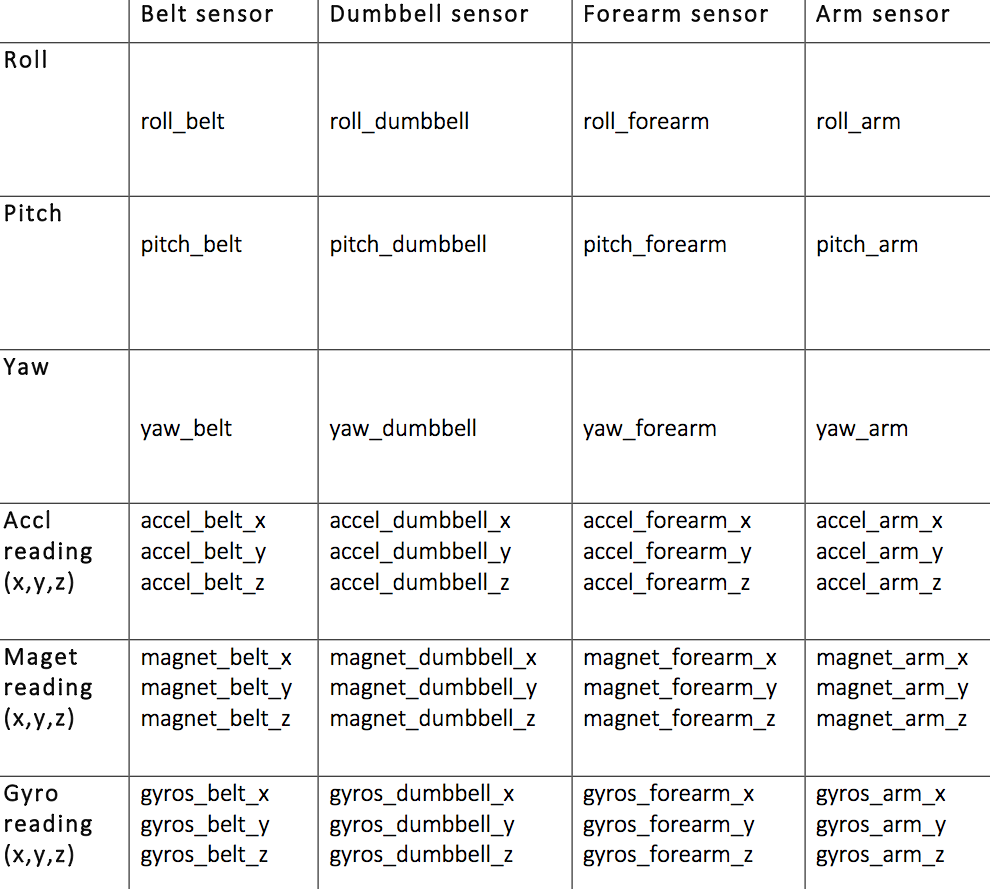

##Getting Data

Download the csv files and then read them into R using following:

```
pmlTraining <- read.csv("/Users/ggharpure/Downloads/pml-training.csv", na.strings = c("NA", "NULL"))
```


##Data exploration and feature selection

Data has following structure


Overall, first seven variables are irrelevant. 
Other variables seem to be derived from above variables. Many of them are also NA. 
We will use above 48 variables as features.
So we subset the data as -
```
basicPredictors <- c("roll_belt", "pitch_belt", "yaw_belt", "gyros_belt_x", "gyros_belt_y", "gyros_belt_z", "accel_belt_x", "accel_belt_y", "accel_belt_z", "magnet_belt_x", "magnet_belt_y", "magnet_belt_z", "roll_arm", "pitch_arm", "yaw_arm", "gyros_arm_x", "gyros_arm_y", "gyros_arm_z", "accel_arm_x", "accel_arm_y", "accel_arm_z", "magnet_arm_x", "magnet_arm_y", "magnet_arm_z", "roll_dumbbell", "pitch_dumbbell", "yaw_dumbbell", "gyros_dumbbell_x", "gyros_dumbbell_y", "gyros_dumbbell_z", "accel_dumbbell_x", "accel_dumbbell_y", "accel_dumbbell_z", "magnet_dumbbell_x", "magnet_dumbbell_y", "magnet_dumbbell_z", "roll_forearm", "pitch_forearm", "yaw_forearm", "gyros_forearm_x", "gyros_forearm_y", "gyros_forearm_z", "accel_forearm_x", "accel_forearm_y", "accel_forearm_z", "magnet_forearm_x", "magnet_forearm_y", "magnet_forearm_z", "classe")

bt <- pmlTraining[, basicPredictors]
```

#Create Data Partition - Training and Testing data
We split the data into training and testing set 
```
library(caret)
inTrain <- createDataPartition(y=bt$classe, p=0.7, list=FALSE)
training <- bt[inTrain]
testing <- bt[-inTrain]

```

##Reproducibility
Set seed so the experiment can be reproduced.
```
set.seed(34567)
```

##Model  – Random Forest
For achieving high accuracy with classification problems, we will try random forest method.
```
mf <- train(classe ~ ., data=training, method="rf")
pred <- predict(mf, training)
confusionMatrix(pred, training$classe)
Confusion Matrix and Statistics

          Reference
Prediction    A    B    C    D    E
         A 3906    0    0    0    0
         B    0 2658    0    0    0
         C    0    0 2396    0    0
         D    0    0    0 2252    0
         E    0    0    0    0 2525

Overall Statistics
                                     
               Accuracy : 1          
                 95% CI : (0.9997, 1)
    No Information Rate : 0.2843     
    P-Value [Acc > NIR] : < 2.2e-16  
                                     
                  Kappa : 1          
 Mcnemar's Test P-Value : NA         

Statistics by Class:

                     Class: A Class: B Class: C Class: D Class: E
Sensitivity            1.0000   1.0000   1.0000   1.0000   1.0000
Specificity            1.0000   1.0000   1.0000   1.0000   1.0000
Pos Pred Value         1.0000   1.0000   1.0000   1.0000   1.0000
Neg Pred Value         1.0000   1.0000   1.0000   1.0000   1.0000
Prevalence             0.2843   0.1935   0.1744   0.1639   0.1838
Detection Rate         0.2843   0.1935   0.1744   0.1639   0.1838
Detection Prevalence   0.2843   0.1935   0.1744   0.1639   0.1838
Balanced Accuracy      1.0000   1.0000   1.0000   1.0000   1.0000

```

Since the accuracy looks fine, we will now try it on testing data.

```
pred_rf_testing <- predict(mf, testing)
confusionMatrix(pred_rf_testing, testing$classe)
Confusion Matrix and Statistics

          Reference
Prediction    A    B    C    D    E
         A 1673   11    0    0    0
         B    1 1126    6    0    0
         C    0    2 1020   22    0
         D    0    0    0  941    0
         E    0    0    0    1 1082

Overall Statistics
                                          
               Accuracy : 0.9927          
                 95% CI : (0.9902, 0.9947)
    No Information Rate : 0.2845          
    P-Value [Acc > NIR] : < 2.2e-16       
                                          
                  Kappa : 0.9908          
 Mcnemar's Test P-Value : NA              

Statistics by Class:

                     Class: A Class: B Class: C Class: D Class: E
Sensitivity            0.9994   0.9886   0.9942   0.9761   1.0000
Specificity            0.9974   0.9985   0.9951   1.0000   0.9998
Pos Pred Value         0.9935   0.9938   0.9770   1.0000   0.9991
Neg Pred Value         0.9998   0.9973   0.9988   0.9953   1.0000
Prevalence             0.2845   0.1935   0.1743   0.1638   0.1839
Detection Rate         0.2843   0.1913   0.1733   0.1599   0.1839
Detection Prevalence   0.2862   0.1925   0.1774   0.1599   0.1840
Balanced Accuracy      0.9984   0.9936   0.9946   0.9881   0.9999

```

This also gave around 99% accuracy. So next we will try it on the test csv data 

```
pt <- predict(mf, pmlTesting)
> pt
 [1] B A B A A E D B A A B C B A E E A B B B
Levels: A B C D E
```

This gives 100% (20/20) accuracy when submitted to auto grader. We will write out the results into a csv.
```
write.csv(pt,file="quiz.csv")
```

##Other models
I also tried method=rpart and and method=gbm. 
Random forest had higher accuracy than both rpart(about 52% accurate) and gbm (97 % accurate). 
Random forest was selected as the final model due to its high accuracy.

##Conclusion
Random forest worked quite well with this data set. 
The only downside is that it trained for about 50 mins on my machine. The computational complexity of the method is very much visible.

##References
The data for this project come from this source: http://groupware.les.inf.puc-rio.br/har.


